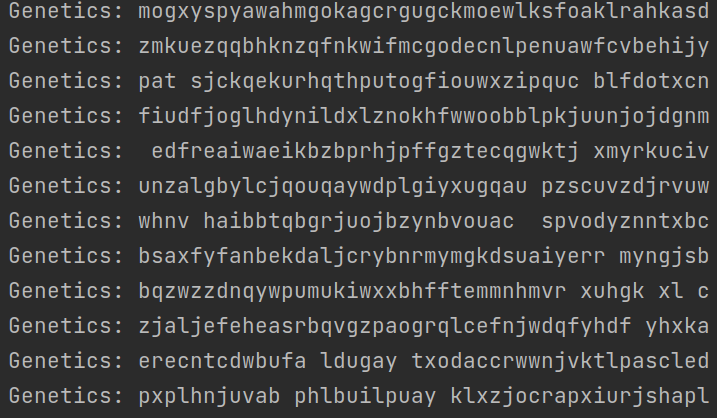
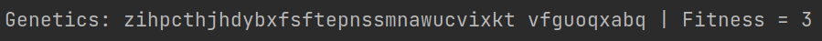
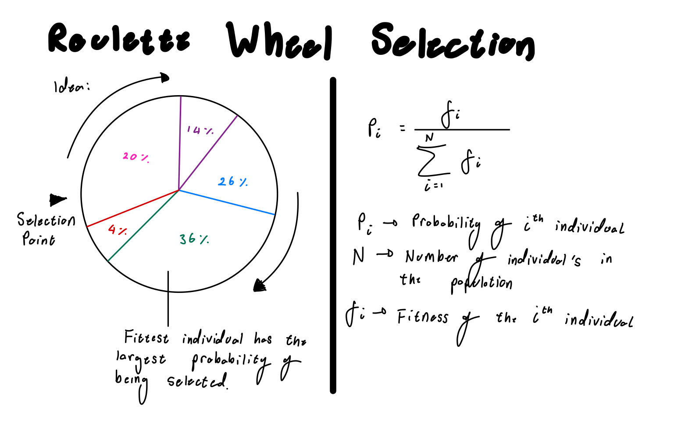
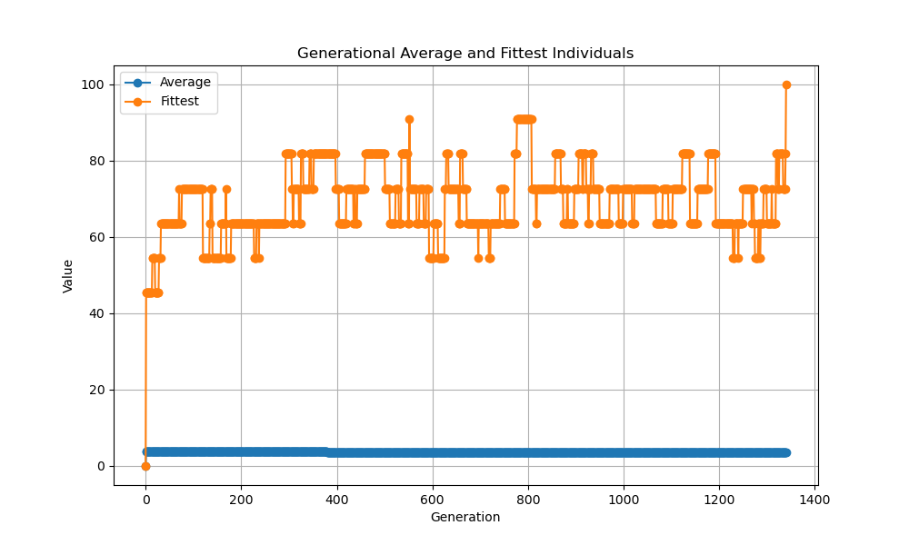

# Genetic-Algorithm-Intro
An outline and example Genetic Algorithm to help understand the core principles underlying the meta-heuristic optimization algorithm

## Introduction
### Genetic Algorithm Outline 
Below is pseudocode outlining the general execution of the Genetic Algorithm (GA). 
Please note this is only outlines the general process. Take the idea and make it your own, fitting it to your idea. 
Boost your understanding of the GA by following the logical process of evolution as we know it. 
The algorithm aims to mimic this process as closely as possinle. 
Best of luck!

```Python
# Specify probabilities of mutation and reproduction
prob_reproduce = 90%
prob_mutate = 15%

# Generate initial population with n chromosomes
for ind in Population:
    INITIALIZE(ind)
    
# Determine goal at which process halts    
while Goal is not met:
    parent 1 <- SELECTION(Population)
    parent 2 <- SELECTION(Population)
    
    # Reproduction
    if reproduce:
        child 1, child 2 <- REPRODUCE(prent 1, parent 2)
    else: 
        child 1, child 2 <- parent 1, parent 2
        
    # Mutation
    for child in children:
        if mutate:
            child <- MUTATE(child)
    
    # Addition to the population
    ADD_CHILD_TO_POPULATION()
```

Please note, there are multiple ways to add a child to the population. 
I will provide two possibilities amongst many below. 
1. Stable Population
    This is the method on which the above pseudocode is based such that the children replace the parents in the population,
    such that the size of the population never increases/decreases but remains stable. 
2. Increasing Population
    This will require a slight modification of the pseudocode, as the parents and children may both be kept within the population. 
    This will explosively increase the size of the population. A death factor to regulate the growth of the population may be 
    necessary. This is to save computational resources and ensure your computer does not crash if the population grows too large. 

### Advice
Below are two keys pieces of advice to help you in this project. 
1. **The KISS principle**
    A good friend told me when you are coding, **K**eep **I**t **S**imple **S**tupid, the KISS principle. 
    It means to not overcomplicate what you are trying to solve, oftentimes we overcomplicate what we are trying to solve. 
    Keep it as simple as you can. 
2. **MVP Principle**
    This is a software developement principle, the Minimal Viable Product (MVP). It is linked to the KISS principle, 
    such that your first product goal is to get the most simple form the GA working. From this working version you can improve, 
    or experiment with it, but aim to achieve the Minimal Viable Product first.

### Further Information
Please find the attached document detailing Evolutionary Algorithms. 
This includes additinal notes on the each of the below documented elements of a Genetic Algorithm 
and the underlying theory of how/why evolutionary algorithms work. 
Please note the theory is challenging but an interesting aspect of GA's. 

[Evolutionary Algorithms](resources/evolutionary_algorithms.pdf)

All rights and attributions to to Professor Kurt Driessens, the professor of the course Intelligent Systems 
at Maastricht University, from which the notes and information of this project are composed. 

## Task
Target: `hello world`

The overall task is to use a genetic algorithm to produce an individual that matches the above target.

## Instructions and Ideas

### 1. Create an Individual
This task asks you to make an individual using an Object-Oriented Programming (OOP) approach. 
This means that each individual should contain a genome of letters (44 characters) including the space.
As well as a numerical value representing the fitness of the individual. 
In summary, the Individual class should contain two fields: 
- Genetics: The string containing the genetic information of the individual
- Fitness: Initialize to zero to start. This will be continued in task 3.

#### What is an Individual 
An individual is a single entity within a population. 
An individual contains a genotype (genetic material) and based on this genotype, 
a phenotype (individual characteristics) is created.

There exist two ways in which an individual is created: 
1. Randomly created within the initial population
2. The result of reproduction between two parent individuals


### 2. Create a Random Initial Population 
In this case, we focus on the random initialization of an individual.
The target string is 44 characters long, therefore each individual when randomly initialized should 
contain a random combination of 44 characters including the " " space. 
This random assortment then form the individual's genome, where the phenotype is if the assortment begins to make words
and have meaning.

I suggest, creating a population class that is capable of holding all individuals within a list. 
This will allow you to create a `random_population()` method to generate an initial population. 
Additionally, this structure will allow you to calculate the fitness per generation as well as other useful functions.

#### What is a Population
A population is the sum of all individuals in a generation. 
In this case, the first generation will be made up of individuals that have been randomly created. 

#### Random Individual Initialization Example

Individual 1: `assjftiuasn rtionsw sdf wefgenrbertb deuvieu` \
Individual 2: `ebefvwoev wevew  wevkmvns ievo eoivrnwwwver ` \
Individual 3: `iubgwe rypdldvnms webrvbuwyerv edvnweiiwrevd` \

#### Random Population Example


### 3. Evaluate each Individual using a fitness function
Create a fitness function that can numerically evaluate the fitness of an individual based on their genetic 
composition (their phenotype). The fitness values for each individual informs reproduction and survival probabilities,
and it an essential element of a Genetic Algorithm. 

I would suggest placing the fitness function within the `Individual` class. 
Additionally, I would suggest calling it to calculate the fitness after each time a new individual is created. 

As a last additional task, I would suggest providing a method in you `Population` to capture the average fitness,
to serve as a measure of fitness per generation. This should gradually show an increase through the generations 
as individuals get closer to the `target`.

#### What is a fitness function
A fitness function is a numerical method of determining how close an individual is to reaching the optimal target.
The fitness function provides a way od determining which individuals are the fittest. The saying "Survival of the fittest" 
implies that fitter individuals have a higher probability of reproducing and passing their genetics to the next population. 

Please note, that the construction of the fitness function is one of the most difficult elements of a Genetic Algorithm, as 
its rules and structure determine the individuals fitness and influence reproduction. 
There can exists penalties and bonuses to ensure certain traits carry forth or to halt certain traits. 

Please feel free to modify the fitness score if you have an idea or want to test something out.


#### How to construct a simple fitness function
The `target` string consists of 44 characters. A simple fitness function will evaluate each individual's genetics against the
`target` string, and count the number of character matches in the correct position. This means that the perfect individual
matching the `target` will have a maximum score of 44. 

#### Example

Target: **with enough probability anything is possible**


The first match exists at `index=1` matching the `i` characters.

### Implement a Selection Function
Within the GA selection exists to determine the selection of the parents that will reproduce. 
The traditional survival of the fittest method may lead to stagnation of the population genetics due to the same parents being selected. 
Multiple methods have been created to maintain genetic diversity while still maintaining a selection of good quality/ higher fitness parents. 
The `Selection.py` file contains a few of the possible selection methods. 
There will be variable results based on the selection method, so careful consideration of the correct method or experimentation is
crucial to determine what works for your genetic algorithm. 

Please note, the graphs below are sourced from my studies at Maastricht University, specifically the Intelligent Systems course
run by Kurt Driessens. 
Full accreditation goes to the original author.

Three possible selection methods are provided below. The selection methods have varying levels of implementation difficulty arranged in the
following order (easiest to hardest).
1. Tournament Selection
2. Roulette Wheel Selection
3. Boltzman Selection

I would suggest following the Minimal viable Product (MVP) method and completing the easiest selection method first. 
Once the GA is working, feel free to implement the more difficult methods and determine how they change the algorithm. 

#### Tournament Selection
Tournament selection randomly selects a subset of individuals from the population and holds a tournament
tp determine which Individual is the fittest within this sub-population. 
The fittest individual is then selected to act as a parent. 

In summary the following steps are performed: 
1. Randomly select a subpopulation of k size from the population
2. Determine the fittest individual from the tournament. 
3. This individual acts as a parent. 

Please note, the size of the subpopulation (k) can be used to tune the selection process. 


#### Roulette Wheel Selection

The roulette wheel selection can be summarized as follows: 
The larger an individuals fitness the larger their probability of selection. The opposite also applies, such that the smaller
an individuals fitness the less probability of them being selected. 
This structure creates a selection behaviour where individuals of higher probability are more likely to be selected and pass good genetics
to the next generation, however random occurrences and suboptimal selections maintains the population diversity and will potentially
improve the genetic algorithm


#### Boltzman or Gibbs Distribution
The Boltzamn/ Gibbs selection is based on the Boltzman/ Gibbs distribution. 
It extends the capability of the Roulette wheel (see similarities in equations), however it includes Temperature (T). 
Temperature is a fine-tuning parameter that allows the selection to be more random (high values of T) or more deterministic (low values of T)
based on the values of T. 
**Note:** Determinsitc behaviour is such that the highest fitness individual is always selected. (Always selects the fittest individual).


A common usage of this methodology is to begin with a more random (high T value) in order to introduce diversity into the population, 
and decrease Temperature (T) gradually as the generations continue in order to move from random behaviour to a more deterministic selection. 


### Reproduction
Reproduction involves the two selected parents from the **Selection** process. 
This process allows for the combination of the parent's genetics. This introduces new individual's with diverse genetics which
may have better/ worse genetics that the parents. 

There are multiple methods of performing the Reproduction process. 
They are described below: 

#### 1. Single Point Crossover
A single random point (index) in the length of the individuals genetics is selected. 
This point serves as the single point at which to crossover. 
Based on the single point two children are created, using opposite genetic elements from each of the parents. 
The below diagram visualizes the concept in a simple and easily understandable manner. 


#### 2. Double Point Crossover
The Double Point Crossover extends the idea introduced in Single Point Crossover. 
Except there are two random points (index) chosen. 
The below diagram visualizes the process.


#### 3. Uniform Crossover
The Uniform Crossover makes use of a uniform distribution to decide at each element of the genetics, wheter the 
element should be included in Child 1 or Child 2. 
The below diagram visualizes this process: 


### Mutation
Similar to real-world evolution mutation is a chance encounter which changes elements of an individual's genetics. 
The mutation can be beneficial or disadvantageous effecting the survival/ fitness of the individual. 
In a GA and similar to the real-world genetics is a process that occurs rarely. 
To mimic this the process of evolution must be probabilistic, such that only ..% of the time it is executed. 
In this example mutation only occurs 15% of the time. 

There are multiple methods of applying mutation. 
Below details the possibilities of mutation for this GA example. 
Please note, there are other possibilities based on an Individual's genetic composition. 
Please review the provided document for more information. 

#### 1. Single Point Mutation
A single random point (index) in an individual's genetics is selected and a random character replaces it at this position. 

#### 2. Uniform Mutation
At every point (index), the element is replaced by a randomly selected character. 
Please note that if this option is selected the probability of mutation should be very small (less that 10%). 
This form of mutation may increase diversity significantly, but it may take more time to converge to a solution. 


## Results
Sample results are shown below. 
It is important to note that if the results you get first are not what you expected, altering the parameters 
of the GA can have a significant effect. The results below will showcase the wide and varied results caused by differing 
parameters. Hence why the creation of a succesful GA algorithm is as much an art, as it is a science. 

### Results 1


#### Parameters:
- Generations = 30 000
- Population size = 10 000
- Early stop condition if target achieved: True
- Reproduction probability = 0.98
- Mutation probability = 0.05
- Selection = Tournament
- Selection pool size = 1000